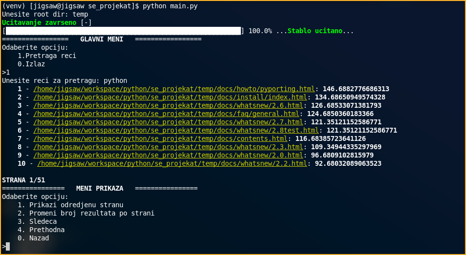

# Search engine assignment project

## Setup
All dependencies are listed in the requirements.txt and can be installed via
```
. <venv_folder>/bin/activate
pip install -r requirements.txt
```

## Usage:
Should be run via terminal as UI is suited for such environment:

```
python main.py
```
Enter root directory path and follow prompts
