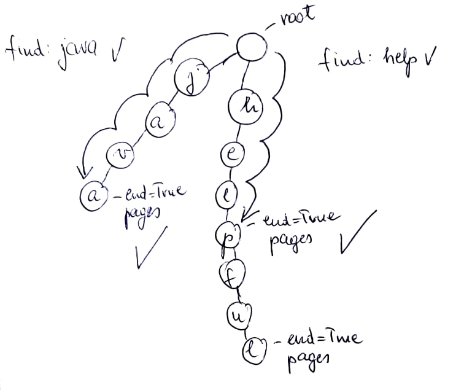
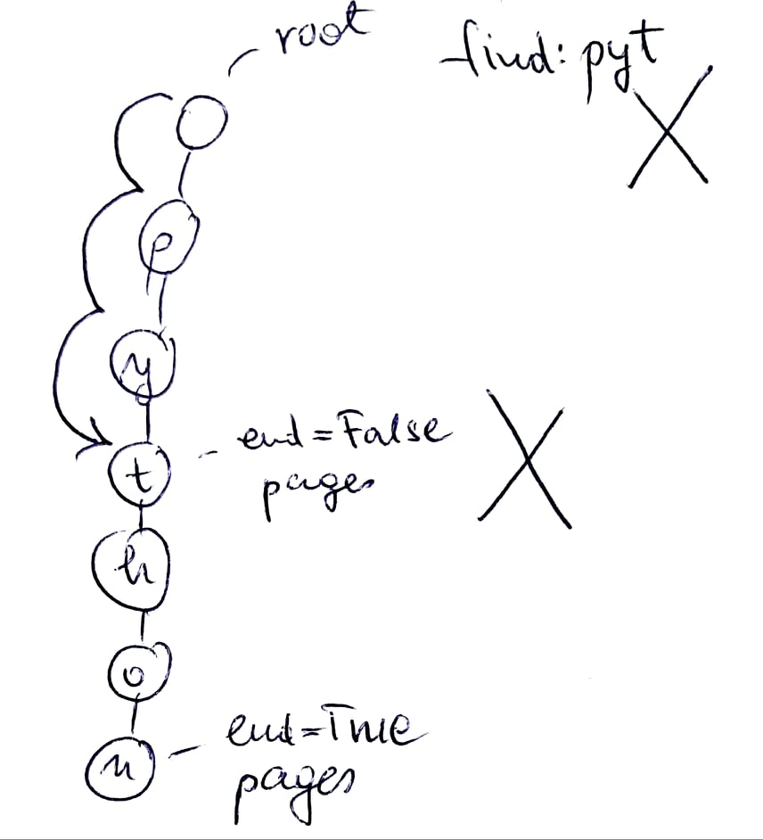

**Objašnjenje upotrebljenih algoritama**

**RANGIRANJE**

Rang stranice određen je sledećom formulom:


Poseban slučaj ako je QC = 0:


**R** - Rang stranice

**QC** - Query count, broj traženih reči u toj stranici

**PR** - PageRank te stranice

**BL** - Broj traženih reči u stranicama koje pokazuju na trenutnu
stranicu

**pr\_w** - PageRank weight, uticaj PageRank-a (određeno
eksperimentalno)

**bl\_w** - Backlink weight, uticaj backlink-ova (određeno
eksperimentalno)

Query count je dobavljen od trie-a i poznat je. Broj reči u
backlink-ovima je takođe poznat, jedino što treba da se izračuna jeste
PageRank; on se računa iterativno.


N - ukupan broj čvorova u grafu

d - faktor korigovanja, najčešće 0.85

```python
# Iterativno racunanje ranga
for _ in range(self, itermax):
    new_ranks = {}
    for pi in self._ranks:
        new_ranks[pi] = factor
        for pj in self._backlinks[pi]:
            new_ranks[pi] += d * (self._ranks[pj] / self._L[pj])
    self._ranks = new_ranks
```

I konačan rang se dobija ovako

```python
# Funkcija za racunanje ranga
def rank_pages(self, pages):
res = Set()
        pages = dict(zip([p.path for p in pages],
                         [p.count for p in pages]))
        # Uticaj PR-a na rank, empirisjki odrediti
        PR_WEIGHT = 1.0 / 3.0
        # Uticaj backlinkova sa trazenim upitom
        BL_WEIGHT = 1.0 / 3.0
        for r in pages:
                c = pages[r]
                blsum = sum([pages.get(i, 0) for i in self._backlinks[r]])
            if c != 0:
                rank = (pages[r] * (1 + self._ranks[r] * PR_WEIGHT)
                        + blsum * BL_WEIGHT)
            else:
                rank = self._ranks[r]
            res.add(Result(r, rank))
```

**SORTIRANJE**

Za sortiranje upotrebljen je Timsort algoritam, koji je izveden iz merge
i insertion sort algoritama.

Timsort iskorišćava činjenicu da insertion sort bolje sortira manje
nizove, te originalni skup podataka deli na RUN-ove veličine 32 i njih
sortira pomoću **insertion** sorta. Kada se sortiraju svi RUN-ovi vrši
se njihovo međusobno spajanje pomoću **merge** algoritma.

Razlog biranja algoritma: izgledao mi zanimljivo i kao zabavan za
implementaciju :)

Najgori slučaj: O(nlogn)

Najbolji slučaj O(n)

```python
# Timsort
def timsort(arr):
    n = len(arr)
    # Soritranje pojedinacnih RUN-ova
    for i in range(0, n, RUN):
        _insertion_sort(arr, i, min((i + 31), (n-1)))

    # Spajanje pojedinacno sortiranih RUN-ova
    # u sve vece i vece, 32, 64, 128 ...
    size = RUN
    while size < n:
        for left in range(0, n, 2*size):
            mid = min((left + size - 1), (n-1))
            right = min((left + 2*size - 1), (n-1))
            _merge(arr, left, mid, right)
        size *= 2
```

**USMEREN GRAF**

Graf je predstavljen kao objekat koji sadrži 2 python dict-a:

```python
class Graph:
    def __init__(self):
        self._vertices = {}
        self._backlinks = {}
```

Vertices:

key - putanja fajla

value - Vertex objekat

Backlinks:

key - putanja fajla

value - lista fajlova koji pokazuju na key, fajlovi su predstavljeni
putanjima

```python
# Predstavlja jedan fajl u grafu
class Vertex(object):
    __slots__ = ('_path', '_words', '_links', '_rank')
    def __init__(self, path, words=None, links=None,
                  links_to=None):
          # Putanja fajla
            self._path = path
          # Reci u fajlu
            self._words = [] if words is None else words
          # Linkovi u fajlu, na koje taj fajl pokazuje
            self._links = [] if links is None else links 
```

Kako svaki vertex sadrži u sebi linkove na druge vertex-e, graf je
usmeren.

Graf se učitava na samom početku programa, kada se odabere početni
(root) direktorijum. Svaki .html fajl dodaje se u graf u obliku Vertex
objekta, zajedno sa svojim linkovima i rečima. Posle učitavanja celog
grafa, formiraju se backlink-ovi jer je potrebno da svi čvorovi postoje
za taj korak.

```python
# Ucitavanje grafa
for root, dirs, files in os.walk(start):
        for file in files:
            current = loading_rotation(current, 'Ucitavanje grafa...')
            if file[-5:] == '.html':
                path = root + os.path.sep + file
                path_root = os.path.abspath(os.path.dirname(path))
                filepath = path_root + os.path.sep + file
                links, words = parser.parse(path)
                # NOTE(Jovan): Informacije o stranici pretvaraju se
                # u vertex
                vertex = Vertex(filepath, words, links)
                graph.add_vertex(vertex)
    graph.gen_backlinks()
```

**SET**

```python
class Set():
    def __init__(self, values=None):
            if values is None:
                    values = []
                self._values = values
                self._remove_duplicates()
```

Skup je modelovan kao lista koja ne dozvoljava duplikate. Podržava
operacije AND (\*), OR (+) i NOT (-) koje se mogu koristiti na sledeći
način

A = Set()

B = Set()

A \* B

A + B

A - B

```python
    def __mul__(self, other): # AND
        ret = Set()
        for i in self._values:
            if i in other:
                ret.add(i)
        return ret
    def __add__(self, other): # OR
        ret = Set(self._values)
        for i in other:
            ret.add(i)
        return ret
    def __sub__(self, other): # NOT
        ret = Set()
        for i in self._values:
            if i not in other:
                ret.add(i)
        return ret
```

**PAGINACIJA**

```python
class SearchDisplay:

    def __init__(self, results, count=None):
            self._results = results
            self._pages = []
            self._count = 10 if count is None or count < 1 else count
            self._page_count = 0
```

results - nepodeljena lista rezultata

pages - lista podlista, rezultati podeljeni na stranice, promenljivo

count - broj rezultata po stranici, promenljivo

page\_count - broj strana, promenljivo

Strane se dele pomoću sledeće funkcije:

```python
def _paginate(self):
          self._pages = [self._results[i:i+self._count]
                       for i in range(0, len(self._results),
                                     self._count)]
          self._page_count = len(self._pages)
```

Stvara se nova lista koja u sebi sadrži podliste određene dužine (count)
i ažurira se page\_count.

**TRIE STABLO**

Trie stablo je modelovan tako da svaki čvor predstavlja jedno slovo.

Na početku inicijalizujemo koren stabla.

```python
class Trie:
   def __init__(self):
       self.root = TrieNode()
```

Svaki čvor trie stabla u sebi ima

-   dictionary children (dete čvora)

-   dictionary pages (ključ je path, a vrednost objekat klase Result -
    > dole objašnjeno)

-   end (označava kraj reči tj. poslednje slovo)

```python
class TrieNode:
   def __init__(self):
       self.children = {}
       self.end = False
       self.pages = {}
```

Klasa Result

Ima u sebi path sa brojem pojavljivanja neke reči

```python
class Result:
   __slots__ = ['_path', '_count']

   def __init__(self, path, count=None):
       self._path = path
       self._count = 1 if count is None else count
```

**DODAVANJE REČI U TRIE STABLO**

Dodavanje reči u trie stablo se vrši metodom add.

```python
def add(self, word, page):
   current = self.root

   for ch in word:
       if not current.contains_key(ch):
           current.put(ch)

       current = current.get(ch)
  
   tmp = Result(page)
   current.add_page(tmp)
   current.set_end()
```

Koraci

1\. Inicijalicija - uvek počinjemo od korena stabla

2\. Iteriramo kroz sva slova reči

3\. Proveravamo da li trenutni (metodom contains\_key - dete od
trenutnog čvora) sadrži to slovo. Ako ne, upisujemo slovo u dete
trenutnog čvora (children je dictionary) metodom put

4\. Sada dete trenutnog čvora proglašavamo trenutnim cvorom metodom get

5\. Ponavljamo 3-4 sve dok ne stignemo do poslednjeg slova

6\. Poslednji čvor (poslednje slovo reči) proglašavamo krajnjim metodom
set\_end. Napravićemo objekat klase Result koja u sebi ima path i broj
pojavljivanja reči. Svaki čvor ima u sebi dictionary pages čiji je ključ
path, a vrednost objekat klase Result. Dodajemo stranicu u čvor (u
dictionary pages) metodom add\_page koja kao parametar prima objekat
klase Result. Ukoliko se reč već nalazi u stablu, samo povećamo broj
pojavljivanja reči u toj stranici (isto metodom add\_page, u dictionary
pages na osnovu path-a koji predstavlja njegov ključ)

```python
def add_page(self, page):  # dodaj stranicu za neku rec
   path = page.path
   if path not in self.pages:
       self.pages[path] = page
   else:
       self.pages[path].inc(1)

def put(self, ch):
   self.children[ch] = TrieNode()

def get(self, ch):
   return self.children[ch]

def contains_key(self, ch):
   return ch in self.children
```

**PRETRAGA REČI**

-   pretrazi treba da prethodi unos (funkcija unos\_upita)

-   validan unos se parsira i smeštamo logički operator (ako postoji) u
    > promenljivu logical, a u niz kriterijum smeštamo reči koje
    > pretražujemo

-   pozivom funkcije pretraga\_unosa počinje pretraga

-   u zavisnosti od vrste logičkog operatora (ako postoji) vršimo
    > pretragu i nalazimo set rezultujućeg skupa stranica

-   u slučaju da imamo logički operator, posle pretrage u trie stablu
    > (što je kasnije objašnjeno), treba da saberemo ukupan broj
    > pojavljivanja obe reči u rezultujućem skupu stranica ili svih reči
    > u slučaju obične pretrage više reči

**PRETRAGA REČI U TRIE STABLU**

Pretraga reči u trie stablu vrši se metodom find.

```python
def find(self, word):
   current = self.root

   for ch in word:
       if not current.contains_key(ch):
           return []
       current = current.get(ch)

   return [] if not current.is_end() else list(current.pages.values())
```

Koraci

1\. Inicijalicija - uvek počinjemo od korena stabla

2\. Iteriramo kroz sva slova tražene reči

3\. Proveravamo da li trenutni (metodom contains\_key - dete od
trenutnog čvora) sadrži to slovo. Ako ne, nema potrebe za dalju pretragu
vratiće praznu listu

4\. Sada dete trenutnog čvora proglašavamo trenutnim čvorom metodom get

5\. Ponavljamo 3-4 sve dok ne stignemo do kraja reči (do poslednjeg
čvora/slova) ili dok ne naiđemo na pogrešno slovo ili ako uopšte nemamo
naredno slovo

6\. Prilikom dolaska do poslednjeg slova tražene reči, moramo proveriti
da li je zaista reč, da nije slučajno samo podskup od neke reči (u nekim
slučajevima podskup reči isto postoji, metoda is\_end nam vraća true :)
) Kraj reči proveravamo metodom is\_end, ukoliko je zaista kraj reči i
postoji, vraća listu Result objekata(path, br. pojavljivanja) u kojima
se tražena reč nalazi, u suprotnom vraća praznu listu

Primer uspešne pretrage

{width="5.038252405949256in"
height="4.234375546806649in"}

Primer neuspešne pretrage

{width="2.994792213473316in"
height="3.2997156605424323in"}
